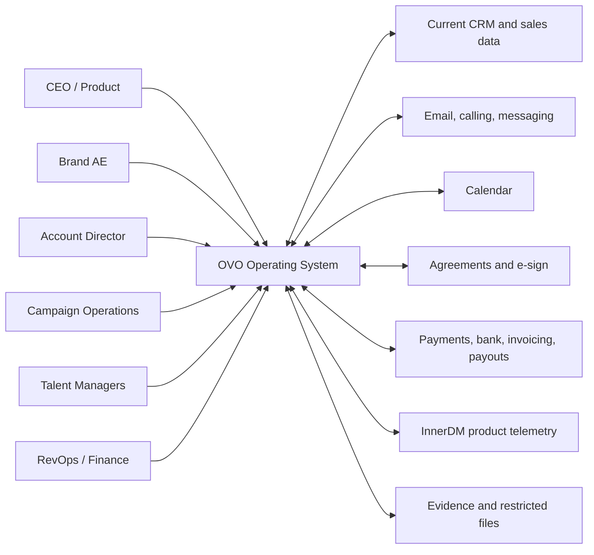
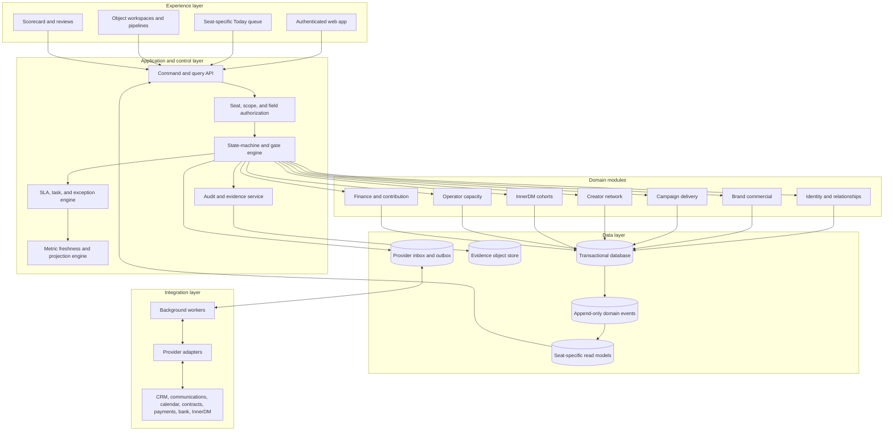
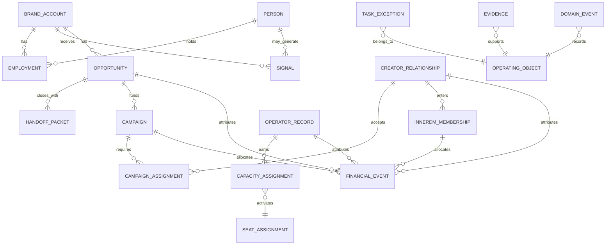
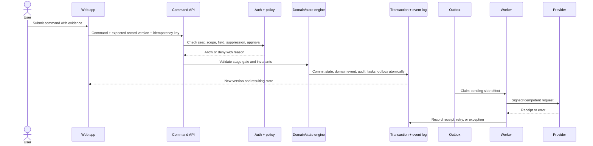
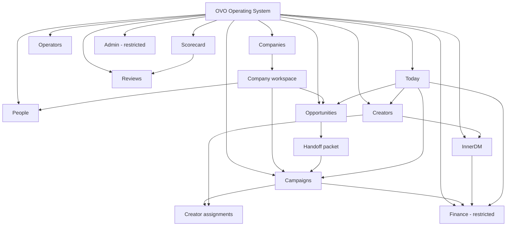
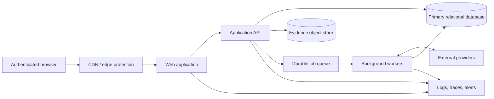

# OVO Operating System Architecture

Status: implementation architecture under [SYSTEM.md](./SYSTEM.md)

Version: 1.0

Effective: 2026-08-21

Architecture owner: RevOps

Business authority: Alex, CEO

This document translates the operating contract into a buildable system. It defines boundaries, records, control flow, operator surfaces, routes, and reliability rules. It does not redefine seats, stages, gates, metrics, or decision rights. If it disagrees with `SYSTEM.md`, `lifecycle-and-routing.md`, or `scorecard-spec.md`, the higher-authority document wins.

## 1. Decision summary

Build one operating system as a **modular monolith with an append-only event history, server-enforced state machines, and seat-specific read models**.

The architecture has five defining decisions:

1. **One object, one lifecycle, many lenses.** A company, person, creator, opportunity, campaign, cohort membership, or operator exists once. Screens are views over those records, not separate copies.
2. **Separate commercial, delivery, and financial truth.** An account is not an opportunity; a closed opportunity is not a campaign; an invoice is not cash; GMV is not OVO revenue.
3. **Commands pass through controls.** Required evidence, authority, capacity, economics, suppression, and version checks run before a state change or external action.
4. **Events create clocks and exceptions.** Every accepted material change is auditable. Due work and breached rules create deterministic tasks; AI may summarize them but may not waive or reprioritize them.
5. **Integrations sit behind adapters and an outbox.** Provider failure cannot erase a local stop, duplicate a transition, or make external state look reconciled.

Do not split this into microservices during the proof cycle. The domains need clear module ownership and database boundaries, but a distributed system would add failure modes before the workflows and load justify them.

## 2. Current implementation boundary

The repository currently contains a local planning prototype:

- `index.html` is the command-center planning surface.
- `operating-flow.html` is a visual operating map.
- Browser storage holds editable planning values and weekly notes.
- Markdown files in this folder hold the operating contract.
- No browser value is authoritative financial, contractual, lifecycle, or current metric truth.

The target architecture below is the production design. It does not claim that authentication, server persistence, provider adapters, state-machine enforcement, or reconciliation already exist.

| Concern | Current prototype | Target production system |
|---|---|---|
| Identity | None | SSO plus seat assignments and scoped access |
| Persistence | Browser-local JSON | Transactional operating database plus immutable event history |
| Workflow | Informational cards | Server-enforced commands, gates, transitions, tasks, and exceptions |
| Integrations | None | Signed webhooks, durable inbox/outbox, retries, and reconciliation |
| Metrics | Manual local entry | Source-backed metric registry with as-of and freshness evaluation |
| Evidence | Links or prose | Restricted evidence objects with retention and audit history |
| Availability | Static local page | Authenticated web app with monitored API and workers |

## 3. System context



The operating system coordinates work and preserves operating history. External providers remain authoritative for the facts they originate until those facts are verified and reconciled locally.

## 4. Logical architecture



### Layer rules

- The browser never decides authorization, stage eligibility, payout eligibility, metric color, or whether an external action is safe.
- Domain modules may share one deployable and database, but they own their commands and tables. Cross-domain changes go through explicit application services and events.
- Read models may denormalize for speed. They are rebuildable and never become a second source of truth.
- Workers execute already-authorized side effects. They do not invent business decisions.

## 5. Bounded contexts

| Context | Owns | Does not own |
|---|---|---|
| Identity and relationships | Brand accounts, people, employment history, creator identity, contact points, merges, aliases, suppression scope | Opportunity stage, campaign stage, cash state |
| Brand commercial | Signals, opportunities, qualification, proposals, forecast, handoff packet | Campaign execution, receipts, creator acceptance |
| Campaign delivery | Campaigns, milestones, capacity plan, assignments, approvals, delivery proof | Opportunity forecast, durable creator relationship, bank settlement |
| Creator network | Creator lifecycle, claims, primary/backup coverage, relationship health, availability | Campaign obligations, InnerDM cohort economics |
| InnerDM | Cohort membership, readiness, launches, D30/D60 decisions, product behavior | Creator master identity, finance settlement |
| Operator capacity | Applicant lifecycle, certification, seat readiness, capacity assignments, D30/D60 evidence | People permissions, creator claims after assignment |
| Finance and contribution | Invoices, receipts, refunds, fees, payouts, costs, commissions, allocation, reconciliation | Sales stages and delivery stages |
| Control plane | Tasks, exceptions, approvals, overrides, policy versions, metric registry, review commitments | Original provider facts or domain-owned stages |

## 6. Canonical data model



`OPERATING_OBJECT` in the diagram is a polymorphic reference, not a separate business record. It lets tasks, evidence, approvals, and events attach to any canonical object without mixing their lifecycles.

### Required fields on every active object

- stable ID, object type, and record version;
- current state and state-entered time;
- accountable seat and assigned person;
- backup or escalation path;
- next action and due time using a named supported-hours calendar;
- source, attribution, and last meaningful activity;
- applicable economics, suppression, risk, and legal-hold state;
- evidence references and terminal reason when applicable;
- created, updated, and effective timestamps.

### Identity rules

- People and employments are separate so a person can move companies without losing history.
- A creator identity is durable across handles, managers, campaigns, and product cohorts.
- Merges preserve both source IDs, actor, reason, winning fields, and a reversible audit trail.
- Defaults shape what a seat sees first; permissions determine what that seat may access. The two are never conflated.

## 7. Command, event, and side-effect flow



### Command contract

Every mutation includes:

- actor identity and active seat assignment;
- object ID, object type, and expected version;
- command type and submitted fields;
- evidence references;
- idempotency key;
- correlation and causation IDs when triggered by another action;
- policy version and requested effective time.

Reject stale record versions with a visible conflict. Never let last-write-wins silently replace an assignment, stage, payout, suppression, or approval.

### Event contract

Every accepted material change records the fields required by `pipeline-and-automation.md`: object and event type, prior/new state, effective and received timestamps, actor/provider, evidence, idempotency key, policy version, correlation ID, and causation ID.

Domain events are immutable. Corrections append a compensating event and update the current projection; they do not rewrite history.

### Provider intake

```text
signed webhook or cursor pull
  -> immutable provider inbox
  -> signature/schema validation
  -> idempotency and duplicate check
  -> identity resolution
  -> local suppression and policy evaluation
  -> domain event or unresolved-intake exception
  -> read-model update
```

Keep the raw provider payload restricted and retention-controlled. Store normalized operating facts separately so access to a contact record does not imply access to every raw payload.

## 8. State machines, gates, and exceptions

The stage dictionaries and exit evidence live only in [lifecycle-and-routing.md](./lifecycle-and-routing.md). Code consumes versioned definitions or implements generated equivalents; it does not maintain a second hand-written set of stage names.

For every requested transition, the state engine evaluates:

1. actor authority and scope;
2. current record version and allowed next state;
3. required fields and evidence;
4. suppression, incident, risk, and legal holds;
5. capacity and financial gates where applicable;
6. independent approval requirements;
7. next owner, action, due time, and supported-hours calendar;
8. events, tasks, notifications, and outbox effects produced by the transition.

The system returns a machine-readable denial reason plus a human explanation. A blocked transition never partially writes state or dispatches a provider action.

### Exception priority

Use the deterministic order in `pipeline-and-automation.md`:

1. safety, payment restriction, account restriction, or legal/compliance hold;
2. likely campaign miss inside 72 hours;
3. unreconciled cash, payout, or commission variance;
4. qualified-commercial or engaged-creator response breach;
5. missing owner, next action, due time, or exit evidence;
6. capacity below sold obligation plus buffer;
7. stale metric or signal;
8. unresolved provider event.

Models may summarize evidence or draft a recommended action. They cannot change severity, approve an exception, move money, create a commitment, or mark a task complete.

## 9. Financial architecture

Financial events form a subledger linked to source objects. Do not store one mutable `revenue` field on an opportunity or campaign.

| Event class | Examples | Authority before reconciliation |
|---|---|---|
| Contractual | invoice issued, payment due, creator obligation | Agreement plus invoice/accounting system |
| Cash | receipt settled, refund settled, dispute, payment fee | Bank or payment processor |
| Creator liability | payout earned, held, released, reversed | Agreement, assignment, delivery, and payout provider |
| Direct cost | production, fulfillment, variable software, direct labor | Approved bill, time record, or provider record |
| Incentive | originator, recruiter, manager commission | Signed plan plus reconciled eligibility calculation |
| Allocation | shared-cost allocation, product/engine attribution | Versioned allocation policy |

The contribution projection applies the waterfall in `SYSTEM.md` to settled, reconciled events. Every result must drill down to its events and policy version. Brand Partnerships and InnerDM retain separate P&Ls even when the same creator or operator participates in both.

## 10. Metric and review architecture

The metric registry stores definition, unit, owner, source query/report, freshness limit, comparison rule, thresholds, and red action. A metric observation stores value, as-of time, collected time, source reference, calculation version, and reconciliation status.

Evaluation order:

```text
missing source/value -> Unknown
else as-of exceeds freshness limit -> Stale
else calculation unreconciled when reconciliation is required -> Unknown
else apply the metric's explicit threshold semantics
```

Weekly commitments are first-class records linked to a metric or operating object, owner, target state, due time, and completion evidence. Notes alone do not satisfy a commitment.

## 11. Operator information architecture

### Page hierarchy

```text
OVO Operating System (/)
├── Today (/today)
│   ├── My actions (/today/actions)
│   └── Exceptions (/today/exceptions)
├── Companies (/companies)
│   └── Company workspace (/companies/{company-id})
│       ├── People
│       ├── Opportunities
│       ├── Campaigns
│       ├── Communications
│       ├── Agreements and evidence
│       └── Finance [restricted]
├── People (/people)
│   └── Person record (/people/{person-id})
├── Opportunities (/opportunities)
│   └── Opportunity workspace (/opportunities/{opportunity-id})
├── Campaigns (/campaigns)
│   └── Campaign workspace (/campaigns/{campaign-id})
│       ├── Plan and milestones
│       ├── Creator assignments
│       ├── Approvals and evidence
│       └── Reconciliation
├── Creators (/creators)
│   └── Creator workspace (/creators/{creator-id})
│       ├── Relationship
│       ├── Campaign assignments
│       ├── InnerDM memberships
│       └── Payments [restricted]
├── InnerDM (/innerdm)
│   ├── Cohorts (/innerdm/cohorts)
│   └── Membership (/innerdm/memberships/{membership-id})
├── Operators (/operators)
│   └── Operator record (/operators/{operator-id})
├── Finance (/finance) [restricted]
│   ├── Reconciliation (/finance/reconciliation)
│   ├── Receivables (/finance/receivables)
│   └── Payouts and commissions (/finance/payouts)
├── Scorecard (/scorecard)
├── Reviews (/reviews)
│   └── Weekly review (/reviews/weekly/{date})
└── Admin (/admin) [restricted]
    ├── Seats and access (/admin/access)
    ├── Policies and approvals (/admin/policies)
    ├── Integrations (/admin/integrations)
    ├── Metric registry (/admin/metrics)
    └── Audit log (/admin/audit)
```

### Visual sitemap



### Route map

| Surface | Route | Parent | Primary seats | Priority |
|---|---|---|---|---|
| Today | `/today` | — | All | Highest |
| Companies | `/companies` | — | AE, Account Director, RevOps, CEO | High |
| Company workspace | `/companies/{company-id}` | Companies | Same, field-scoped | High |
| People | `/people` | — | Commercial and operations seats | Medium |
| Opportunities | `/opportunities` | — | Brand AE, Account Director, CEO | High |
| Opportunity workspace | `/opportunities/{opportunity-id}` | Opportunities | Brand AE, approvers | High |
| Campaigns | `/campaigns` | — | Account Director, Campaign Ops, TMs | High |
| Campaign workspace | `/campaigns/{campaign-id}` | Campaigns | Delivery seats | High |
| Creators | `/creators` | — | Campaign Ops, Pod Lead, TMs | High |
| Creator workspace | `/creators/{creator-id}` | Creators | Creator seats, field-scoped | High |
| InnerDM | `/innerdm` | — | CEO/Product, Campaign Ops, Finance | High |
| Operators | `/operators` | — | Academy, operating leads, CEO | Medium |
| Finance | `/finance` | — | RevOps/Finance, approved CEO scope | High, restricted |
| Scorecard | `/scorecard` | — | CEO and metric owners | High |
| Weekly review | `/reviews/weekly/{date}` | Reviews | CEO and named owners | High |
| Admin | `/admin/*` | — | RevOps and explicit administrators | Restricted |

### Navigation specification

- The first item for every seat is **Today**. It opens the seat's due actions and exceptions, not a generic dashboard.
- **Companies** and **People** are universal staff nouns. Lifecycle-specific work appears as linked lenses, never duplicate records.
- The remaining primary items are seat-sliced: Opportunities for commercial seats; Campaigns for delivery; Creators for relationship seats; InnerDM for Product; Finance and Admin only for authorized seats; Scorecard and Reviews for owners.
- Global search resolves company, person, creator, opportunity, campaign, cohort membership, and operator IDs. Results disclose object type and access scope.
- Every detail page uses breadcrumbs that mirror its route and exposes parent/child relationships in a compact context rail.
- Mobile primary navigation uses the same definitions and permissions as desktop. A different presentation cannot create different access.

### Internal linking plan

- Today items link directly to the relevant object and open the exact blocked action or exception.
- Company workspaces link to their people, opportunities, campaigns, communications, agreements, and restricted finance projection.
- Closed-won opportunities link to the accepted handoff, funded campaign, and activation financial evidence.
- Campaigns link to every assignment, creator relationship, milestone, approval, delivery artifact, and reconciled financial event.
- Creator workspaces link separately to relationship state, campaign obligations, InnerDM memberships, payout truth, and primary/backup coverage.
- Scorecard observations drill into the source query and the records/events that explain the value.
- No object detail may be orphaned: it needs an inbound link from its index, parent object, Today queue, search, or audit history.

## 12. Read models

Build task-focused projections from domain events:

| Read model | Purpose |
|---|---|
| Seat Today queue | Due actions, exception priority, backups, and commitments for the active seat |
| Company 360 | Durable account plus people, active motions, delivery, communications, and restricted economics |
| Opportunity board | Evidence-backed stage, time in stage, owner, next action, contribution forecast |
| Campaign control board | Milestones, capacity, assignments, approvals, risk, delivery, and reconciliation |
| Creator portfolio | Claims, relationship stage, coverage, responsiveness, obligations, economics, and next use case |
| InnerDM cohort | Readiness, launch time, D30/D60 clocks, payer behavior, labor, and contribution |
| Operator capacity | Certification, available capacity, assignments, productivity, and retention |
| Finance reconciliation | Source events, variances, eligibility, approvals, and terminal settlement |
| Executive scorecard | Valid observations, freshness, trend, red action, owner, and linked commitments |

Every projection records its last processed event cursor. Replay from the event log must rebuild it deterministically.

## 13. Access, privacy, and audit

Authorization evaluates four dimensions on every query and command:

1. authenticated person;
2. active seat assignment and effective dates;
3. object scope, such as assigned portfolio, account, campaign, or company-wide control;
4. field class, such as standard operating data, finance, agreements, identity documents, raw communications, or compliance evidence.

Use least privilege and deny by default. Finance access, raw communications, identity documents, private agreements, and provider payloads require explicit scopes. Search, exports, and analytics must honor the same field rules as detail pages.

Audit events are mandatory for login and access changes, view/export of restricted data, merges, reassignments, stage overrides, suppression, approvals, provider dispatch, payout/commission decisions, and policy changes.

## 14. Integration and reliability rules

- Verify webhook signatures and store receipt time before processing.
- Use idempotency keys for inbound events, user commands, and outbound provider calls.
- Commit domain state and the outbox item in one database transaction.
- Retry with bounded exponential backoff, then create a visible exception; never retry forever invisibly.
- Reconcile from provider cursors or authoritative reports so a missed webhook is recoverable.
- Apply local suppression or incident stops before attempting provider synchronization.
- Quarantine payloads that fail schema, identity, or policy checks; do not guess the target record.
- Back up the primary database and evidence metadata; test point-in-time recovery and event replay.
- Encrypt in transit and at rest; secrets stay in the deployment secret store, never in browser code or repository files.
- Emit structured logs and traces using correlation IDs, with restricted fields redacted.

### Service objectives for the proof cycle

| Capability | Objective |
|---|---|
| Local command acceptance | 99.9% monthly availability during supported hours |
| Safety/suppression commit | Local decision visible within 5 seconds |
| Provider event visibility | 95% processed or visibly excepted within 5 minutes |
| Today queue freshness | New accepted event reflected within 60 seconds |
| Financial reconciliation | No silent variance; unresolved differences visible by the next scheduled run |
| Recovery | Documented daily backup; quarterly restore and event-replay test |

These are architecture targets, not claims about the current prototype.

## 15. Deployment topology



Start with one application deploy and one worker deploy against one primary relational database. Scale read models, workers, or integration adapters independently only after measured load or isolation needs justify it.

Environments are development, staging, and production. Production provider credentials and data never enter development. Staging uses provider sandboxes or synthetic records and runs the full state-machine, permissions, replay, and reconciliation suites before promotion.

## 16. Build sequence

This sequence refines the four-week installation plan into technical increments:

1. **Contract package:** machine-readable object types, stage dictionaries, required evidence, metric registry, seats, policies, and versioning.
2. **Identity spine:** SSO, seat assignments, stable IDs, people/employment history, creator identities, merges, and suppression.
3. **Command and event core:** optimistic concurrency, idempotency, append-only events, audit, tasks, exceptions, inbox, and outbox.
4. **Brand commercial path:** account, signal, opportunity, contribution forecast, proposal gate, closed-won gate, and handoff.
5. **Delivery path:** campaigns, capacity plan, explicit creator assignments, approvals, proof, and reconciliation linkage.
6. **Creator and operator paths:** claims, primary/backup coverage, transfer, certification, capacity assignments, and D30/D60 timers.
7. **InnerDM path:** readiness, canary evidence, launch, cohort clocks, product facts, and separate economics.
8. **Finance and scorecard:** subledger ingestion, reconciliation, contribution projections, metric observations, freshness, and review commitments.
9. **Provider rollout:** enable adapters one at a time behind reconciliation and kill switches.
10. **Prototype retirement:** preserve the docs and visual map; replace browser-local operating values only after production reports reconcile.

## 17. Architecture acceptance tests

The architecture is implemented only when automated tests prove:

- all five canonical pipelines use the exact versioned stages and exit criteria;
- missing evidence, capacity, authority, or independent approval blocks the transition atomically;
- duplicate commands, webhook replay, and worker retry do not duplicate state or external action;
- a do-not-contact event racing a queued send commits the local stop and prevents dispatch;
- concurrent edits produce an explicit version conflict rather than silent overwrite;
- opportunity close creates no campaign completion or collected-cash state;
- delivery, cash, payouts, costs, and contribution reconcile through drillable events;
- Unknown and Stale evaluate before metric thresholds;
- unauthorized seats cannot infer restricted values through lists, search, export, analytics, or errors;
- projections rebuild from events and match the primary records;
- ten records complete every relevant handoff without Alex routing routine work;
- backup restore plus event replay recreates the tested read models.

## 18. Deferred decisions

These choices require implementation discovery and should not be guessed in the operating contract:

- which existing CRM remains the identity authority during migration;
- which accounting, bank, contract, communication, calendar, and payout providers become production adapters;
- the production hosting vendor and managed database product;
- exact supported-hours calendars and regional retention requirements;
- data residency, legal retention, and communication-analysis consent rules;
- approved finance materiality beyond the current interim $500 independent-approval control;
- when measured scale or team ownership justifies extracting a domain from the modular monolith.

Record each decision as a dated architecture decision with one decider, alternatives considered, migration impact, and rollback path.
